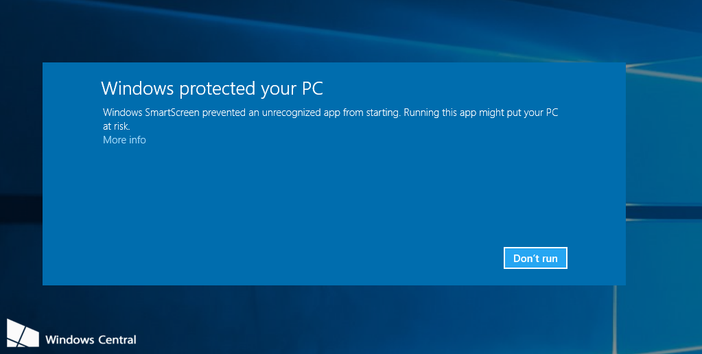

# InsightBuddy AI 👩‍⚕️

# Installation

## How to Install and Use App! 👨‍🏫

[Youtube Tutorial](https://www.youtube.com/watch?v=your_video_id)

Watch this video to learn how to install and use InsightBuddy AI, it is really easy and quick to set up!

## Download Links 😊

### Windows 💻
- [InsightBuddy AI for WINDOWS](https://github.com/pabloRom2004/Insight-Buddy-AI-App/releases/download/1.0.0/InsightBuddy-AI-Setup-1.0.0.exe)

### Mac 🍎
- [InsightBuddy AI for MAC](https://github.com/pabloRom2004/Insight-Buddy-AI-App/releases/download/1.0.0/InsightBuddy.AI-1.0.0-arm64.dmg)

Do note that the app does not have a signing certificate yet, this means that you will need to take some extra steps in order to download it onto your computer
#### On Windows:
- 
-   There will be a screen that appears telling you that the app is unrecognised, you will need to click on 'More Info' under the text and then a button will appear that says 'Run Anyway' you will need to click this to install the software.
#### Mac:
- You will need to install the app to your 'Applications' folder by dragging it to the folder after it has been downloaded and then navigate to your applications folder and right-click and click 'Open' this will come up with a security warning, but you are safe to keep going.

# Screenshots 🖼

# Features

- [Add your key features here]

# How to Use

1. Download the appropriate version for your operating system (Windows or Mac).
2. Install the application by following the installation wizard.
3. [Add any specific instructions for using InsightBuddy AI]

# Support

If you encounter any issues or have questions, please [open an issue](https://github.com/pabloRom2004/Insight-Buddy-AI-App/issues) on this repository.

# License

[Include your license information here]
