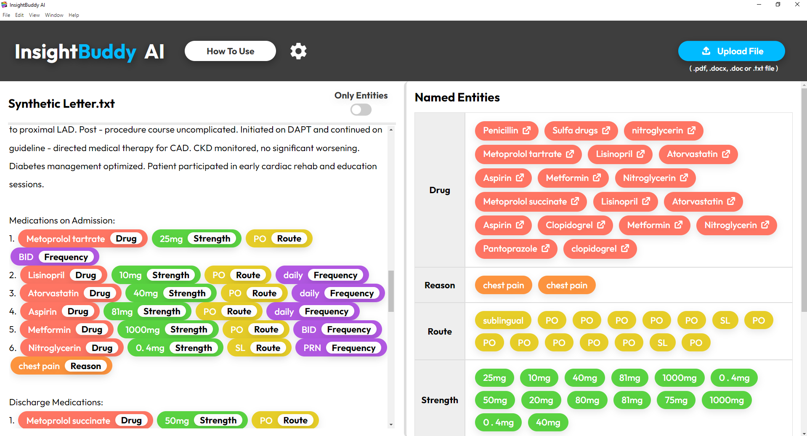
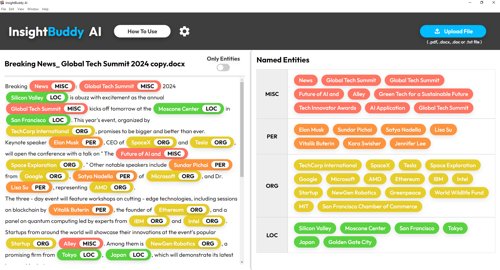
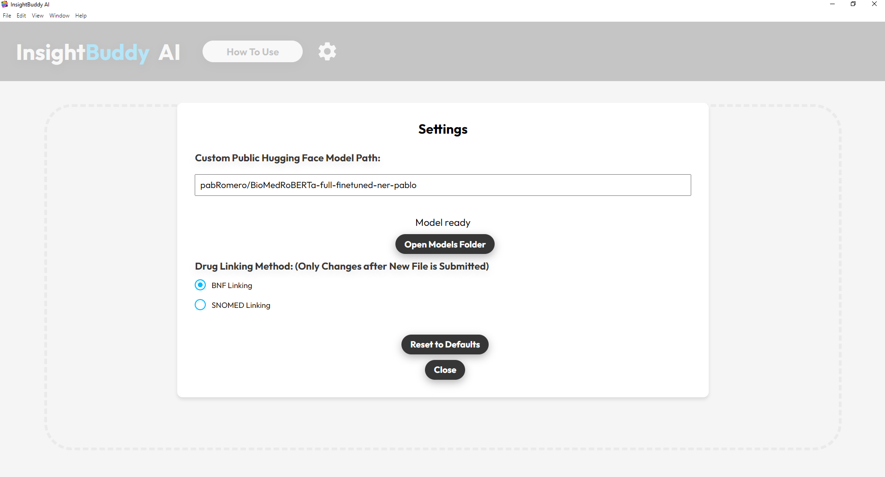
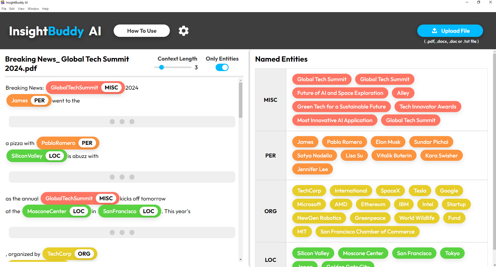

# InsightBuddy AI 👩‍⚕️
Software made by Pablo Romero pablo2004romero@gmail.com

# Installation

## How to Install and Use App! 👨‍🏫

<a href="https://www.youtube.com/watch?v=4NKpcHdxeko&ab_channel=PabloRomero" target="_blank">Youtube Tutorial</a>

Watch this video to learn how to install and use InsightBuddy AI, it is really easy and quick to set up!

## Download Links 😊

### Windows 💻
- [InsightBuddy AI for WINDOWS](https://github.com/pabloRom2004/Insight-Buddy-AI-App/releases/download/1.0.1/InsightBuddy-AI-Setup-1.0.1.exe)

### Mac 🍎
- [InsightBuddy AI for MAC](https://github.com/pabloRom2004/Insight-Buddy-AI-App/releases/download/1.0.1/InsightBuddy-AI-1.0.1-arm64.dmg)

Do note that the app does not have a signing certificate for Windows yet, this means that you will need to take some extra steps in order to download it onto your computer.

#### On Windows:

There will be a screen that appears telling you that the app is unrecognised, you will need to click on 'More Info' under the text and then a button will appear that says 'Run Anyway' you will need to click this to install the software.

#### Mac:
The Mac app is now signed. After downloading, you may see a warning that the app is from the internet. Simply click 'Open' to proceed with the installation. This warning cannot be avoided and is standard for apps downloaded outside the App Store.

# Screenshots 🖼

# References

Please cite our paper if you use this toolkit. 

**INSIGHTBUDDY-AI**: Medication Extraction and Entity Linking using Large Language Models and Ensemble Learning”, 2024. Pablo Romero, Lifeng Han, Goran Nenadic. Forthcoming.

A huge thank you to **Xenova Transformers.js** for making this project a reality!

Xenova Transformers.js: https://github.com/xenova/transformers.js
Hugging Face Transformers.js documentation: https://huggingface.co/docs/transformers.js/en/index"
